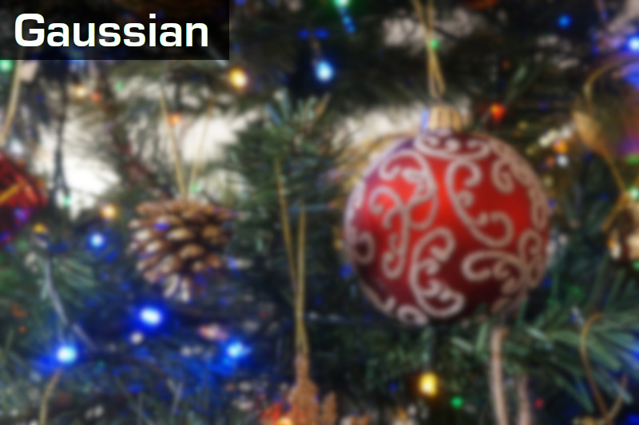
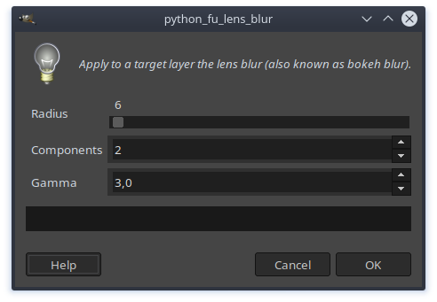

This is a GIMP plugin that add the ability to perform a **Lens Blur** (also know as **Bokeh Blur**).

This code is based on [Mike Pound's implementation](https://github.com/mikepound/convolve) created for [this Computerphile video](https://www.youtube.com/watch?v=vNG3ZAd8wCc). I changed the code to use **OpenCV** for performance gains.

This plugin has been tested on Ubuntu 18.04 and GIMP 2.10.8.

## Requirements

To use this plugin you have to install the following dependencies in the Python environment used by GIMP:

`pip install numpy opencv-python`

## Install

1. Open the terminal, move to the GIMP plug-ins folder (usually `~/.config/GIMP/2.10/plug-ins`).

2. `git clone https://github.com/Davide-sd/GIMP-lens-blur.git`

3. `cd GIMP-lens-blur`

4. Change permission to allow execution: `chmod +x GIMP-lens-blur.py`

## Usage

1. Open GIMP and load the image you'd like to edit.

2. In the layer palette, select the layer you would like to apply the lens blur.

3. Go to `Filters/Blur/Lens Blur...`

4. Adjust the parameters:
    * **Radius**: The amount of blur to add.
    * **Components**: The more components, the better the final result, but the slower the computation. Even with 2 components the result is very nice.
    * **Gamma**: tweak the exposure to highlight bright spots.

5. Click `Ok`.

## TODO

1. Is it possible to implement a preview window?
